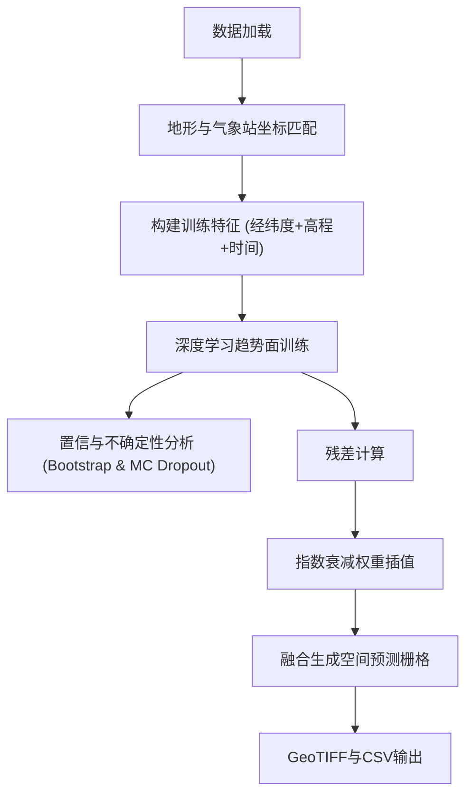

# 基于气象插值的作物产量预测模型研究（Crop Yield Prediction Supported by Meteorological Interpolation）

##  项目简介

本代码库为学术论文《基于气象插值的作物产量预测模型研究（Crop Yield Prediction Supported by Meteorological Interpolation）》的官方实现，提供了完整的算法复现和实验验证环境。本研究通过创新性地结合气象数据插值技术与深度学习模型，实现了对作物产量的精准预测。

项目: Meteorology-Assisted-Crop-Yield-Prediction 

仓库: https://github.com/ZDH4869/Meteorology-Assisted-Crop-Yield-Prediction.git 

联系: zhangdehai1412@163.com 

> **知识产权状态**: ✅ 已通过完整的知识产权保护认证

##  知识产权保护声明

### 版权信息
- **版权所有** © 2025 张德海
- **许可证类型**: [MIT License](LICENSE)
- **学术使用条款**: 详见[知识产权声明](INTELLECTUAL_PROPERTY.md)

### 保护认证
本代码已通过完整的知识产权保护流程，具备法律认可的证据链：

| 保护要素 | 状态 | 认证信息                         |
|---------|------|------------------------------|
| **时间戳存证** | ✅ 已验证 | FreeTSA Timestamping CA      |
| **数字指纹** | ✅ 已生成 | SHA256: `fd47944f...06e418c` |
| **完整性验证** | ✅ 已通过 | 29个文件完整保护                    |
| **法律效力** | ✅ 已确认 | RFC 3161标准认证                 |

### 学术使用规范
1. **审稿权限**: 论文审稿人及相关学术委员会成员有权为审稿目的运行、测试此代码
2. **传播限制**: 在论文正式接受前，请勿公开传播或用于其他学术工作
3. **引用要求**: 如参考本代码思路或方法，请在相关工作中明确引用
4. **学术诚信**: 本代码已进行时间戳存证，可作为原创性证明

### 审稿人专用说明
为便于审稿，我们提供：
- 预训练模型（如适用）：存放在 `1-气象插值代码/输出展示/model`
- 测试数据集样例（待预处理）：存放在 `1-气象插值代码/原始气象数据`
- 测试数据集样例（训练模型）：存放在 `1-气象插值代码/测试数据`

## 🛡️ 时间戳认证详情

### 认证概要
- **认证时间**: 2025-10-24 10:02:07
- **认证机构**: FreeTSA Timestamping CA
- **认证标准**: RFC 3161 时间戳协议
- **哈希算法**: SHA256
- **数字指纹**: `fd47944fc2d792bb07824142a218dbe7da65b9f2f454a0eaa72de257e06e418c`

---

# 气象插值模型说明


本研究构建了一个结合**深度学习趋势预测**与**指数衰减权重插值**的气象数据空间插值系统。系统以气象观测站数据和地形栅格为输入，通过深度学习模型预测趋势项，再利用克里金方法对预测残差进行空间校正，生成高精度、具有置信度评估的气象变量空间分布图。  


---

## 一、总体执行流程

主程序沿下列步骤运行：

1. 读入气象站观测表与地形栅格；进行坐标与有效像元的匹配与验证；根据日期范围筛选观测记录。
2. 对每个目标变量按月循环：构建样本特征、拆分训练/验证集、标准化预处理、初始化深度模型并训练。
3. 对验证集执行置信与不确定性分析（Bootstrap 与 Monte Carlo Dropout 两种），并计算空间不确定性统计量。
4. 将模型趋势与残差通过空间插值（指数衰减权重插值）合成为完整格网，并以 GeoTIFF/CSV 保存结果。

下文按照上述步骤逐项展开数学与实现要点的描述。

---

## 二、数据加载与坐标匹配（输入准备）

代码首先加载观测点集合与地形栅格，并计算有效像元掩码（排除 nodata、NaN、异常高程等），设地形有效像元总数为 $N_g$。对每个观测点取其经纬坐标并与地形网格进行最近邻匹配，得到每个观测点对应的最近有效栅格索引与距离统计（均值、最大值等），用于坐标匹配质量评估。公式化描述为：
$$
\text{terrain\_mask}(i) = \mathbf{1}\{e_i \neq \text{nodata} \land \neg\text{isnan}(e_i) \land 0<e_i<10^4\},
$$
$$
d_k = \min_{j\in \{1,\dots,N_g\}} \; \mathrm{dist}\big( s_k, g_j \big),
$$
其中 $s_k$ 为第 $k$ 个观测站位置，$g_j$ 为第 $j$ 个格网点的位置；距离度量为欧氏距离或投影坐标系下的米度量。代码实现细节见文件。

---

## 三、位置编码与深度网络输入构建

为了增强空间表示能力，在输入的二维坐标 $x,y$ 上使用多频正弦-余弦位置编码，编码维度为 $D$，其数学形式为：
$$
PE(x,y) = \big[\sin(2^i x),\ \cos(2^i x),\ \sin(2^i y),\ \cos(2^i y)\big]_{i=0}^{D/4-1}.
$$
该编码在代码中按频率分段计算以节约内存与显存，并在合并后与其他数值特征（如海拔、年、月）拼接为网络输入。

将位置编码与剩余特征合并后，记输入向量为 $\mathbf{x}\in\mathbb{R}^m$，其中 $m=D + p$，$p$ 为其他数值特征维数（示例中 $p=3$）。

---

## 四、深度学习模型结构（趋势项预测）

深度模型实现为多层前馈映射，抽象为参数化函数 $f_\theta:\mathbb{R}^m\to\mathbb{R}$，其逐层表达为：
$$
\begin{aligned}
\mathbf{h}^{(0)} &= \mathbf{x},\\
\mathbf{h}^{(\ell)} &= \sigma\big( W^{(\ell)} \mathbf{h}^{(\ell-1)} + b^{(\ell)} \big),\quad \ell=1,\dots,L,\\
\hat{y} &= W^{(L+1)} \mathbf{h}^{(L)} + b^{(L+1)},
\end{aligned}
$$
其中 $\sigma(\cdot)$ 为逐层的非线性激活（代码示例采用分段线性激活与层归一化、随机失活作为正则化），权重与偏置集合记为 $\theta=\{W^{(\ell)},b^{(\ell)}\}$。模型架构与层次、维度在代码中以参数表的形式给定并实例化。

---

## 五、训练过程（目标与优化）

训练以最小化稳健损失为目标。损失函数采用 Huber 损失（对小误差使用平方项，对大误差使用一次项），表示为：
$$
L_\delta(e) =
\begin{cases}
\frac{1}{2} e^2, & |e|\le\delta,\\[6pt]
\delta\big(|e|-\frac{1}{2}\delta\big), & |e|>\delta,
\end{cases}\qquad e = y - \hat{y}.
$$

参数通过带权衰减的自适应一阶优化器更新，代码中使用带动量估计与权衰的变种，其一步更新的数学形式可近似表示为：
$$
\theta_{t+1} = \theta_t - \eta_t \frac{m_t}{\sqrt{v_t} + \epsilon} - \eta_t \lambda \theta_t,
$$
其中 $m_t,v_t$ 为一阶与二阶动量估计，$\lambda$ 为权重衰减系数，$\eta_t$ 为学习率。训练过程中还使用梯度裁剪以控制梯度范数：若 $\|\nabla_\theta L\|_2 > g_{\max}$，则按比例缩放。为提高速度与数值稳定性，代码在支持的硬件上启用混合精度运算与相关缩放器。训练-验证按照小批量随机梯度的迭代方式执行，周期性记录训练/验证损失与若干评价指标（决定系数、平均绝对误差、均方根误差）。

常用评价指标定义：
$$
\begin{aligned}
MAE &= \frac{1}{n}\sum_{i=1}^n |y_i - \hat{y}_i|,\\
RMSE &= \sqrt{\frac{1}{n}\sum_{i=1}^n (y_i - \hat{y}_i)^2},\\
R^2 &= 1 - \frac{\sum_{i=1}^n (y_i - \hat{y}_i)^2}{\sum_{i=1}^n (y_i - \bar{y})^2}.
\end{aligned}
$$

---

## 六、置信分析与不确定性分析

不确定性分析在代码中被实现为两大类蒙特卡罗式方法：**Bootstrap 重采样法**与**Monte Carlo Dropout**。二者构成对模型预测不确定性的经验估计基础，代码中通过对验证集数据并行运行两种方法并计算统计量来输出置信度相关指标。相关实现参见源码。

### 6.1 Bootstrap 重采样（样本层不确定性）

设验证集输入为 $\{x_i\}_{i=1}^n$。对每次重采样 $b=1,\dots,B$，从 $\{1,\dots,n\}$ 中以放回抽样得到索引向量 $I^{(b)}=(i^{(b)}_1,\dots,i^{(b)}_n)$，构建重采样数据集并对其做一次前向预测，得到第 $b$ 次的预测序列 $\{ \hat{y}_i^{(b)} \}_{i=1}^n$。收集所有重采样结果构成预测矩阵
$$
P^{(B\times n)} = \big[\hat{y}_i^{(b)}\big]_{b=1..B,\,i=1..n}
$$

由此可定义点估计与区间估计：

- 预测均值：$\bar{\hat{y}}_i = \frac{1}{B}\sum_{b=1}^B \hat{y}_i^{(b)}$  
- 预测区间（两端为百分位数）：令显著性水平 $\alpha$，下、上界分别为第 $100\cdot(\alpha/2)\%$ 与第 $100\cdot(1-\alpha/2)\%$ 分位数，记为 $L_i$ 与 $U_i$：
$$
L_i = \mathrm{quantile}\big( \{\hat{y}_i^{(b)}\}_{b=1}^B,\ \tfrac{\alpha}{2} \big),\qquad
U_i = \mathrm{quantile}\big( \{\hat{y}_i^{(b)}\}_{b=1}^B,\ 1-\tfrac{\alpha}{2} \big)
$$

在代码中，重采样的预测结果以二维数组存储，并通过分位数与矩统计计算若干不确定性指标（均值、标准差、方差、变异系数等）。该实现细节可见源码。

### 6.2 Monte Carlo Dropout（模型预测随机性）

Monte Carlo Dropout 的基本思路是在推理阶段保留随机失活，从而将模型近似视作一个随机函数族。对每次随机前向采样 $t=1,\dots,T$，得到预测序列 $\{\tilde{y}_i^{(t)}\}_{i=1}^n$，构成预测矩阵
$$
\tilde{P}^{(T\times n)} = \big[\tilde{y}_i^{(t)}\big]_{t=1..T,\,i=1..n}
$$

给定 $\tilde{P}$，定义预测均值与方差为：
$$
\bar{\tilde{y}}_i = \frac{1}{T}\sum_{t=1}^T \tilde{y}_i^{(t)},\qquad
\mathrm{Var}_i = \frac{1}{T}\sum_{t=1}^T\big(\tilde{y}_i^{(t)}-\bar{\tilde{y}}_i\big)^2
$$

通过将模型置于“训练模式”以启用随机失活，连续多次做前向推理收集结果，随后恢复为评估模式，并计算上述统计量。

---

## 七、残差空间插值（指数衰减权重）

在每个月份的插值阶段，代码首先在观测点上计算残差：
$$
\varepsilon_k = y_k - \hat{y}_k,
$$
其中 $\hat{y}_k$ 为模型对观测点的趋势项预测。随后对残差场做空间插值以获得格网残差场并与趋势相加得到最终格网预测。指数衰减权重的局部平滑近似实现了加权平滑插值，权函数为指数衰减并进行归一化：
$$
w_i(s_0) = \frac{\exp\big(-d_i(s_0)/r\big)}{\sum_j \exp\big(-d_j(s_0)/r\big)},
$$
其中 $d_i(s_0)$ 为样本点 $i$ 到目标格点 $s_0$ 的距离，$r$ 为可设的尺度参数（代码中以网格大小或经验值近似）。插值值为：
$$
\hat{\varepsilon}(s_0)=\sum_i w_i(s_0)\,\varepsilon_i.
$$

该近似实现通过分块处理（对格网按小块循环）来控制内存占用，并对超大采样点集进行随机下采样以限制计算点数。代码在单块内对每个格点向量化地计算距离并应用权函数以得到该块的残差格值。相关实现见源码（分块、权重、归一化等）。


---

## 八、格网生成、合成与导出

将趋势项与插值残差在有效像元上相加得到格网预测：
$$
Z^*(g_j) = \hat{y}(g_j) + \hat{\varepsilon}(g_j),\quad j=1,\dots,N_g,
$$
对无效像元留空或设为缺测值（NaN）。代码按块逐段计算有效点的输入特征、做标准化、前向推理、再与残差合并，最后将一维数组重塑回与地形栅格相同的二维形状并保存为 GeoTIFF，同时输出汇总的 CSV 表格（按经纬度/高程/年月聚合）。


---

## 五、系统整体流程


## 六、结论 

该方法充分利用深度学习对非线性趋势的建模能力与克里金方法对空间相关性的捕捉能力，实现了对气象要素的高精度空间插值。同时，通过方差传播建立的不确定性分析框架，为结果提供了统计置信支撑，可用于气象监测、生态建模及农业决策分析。  

# 硬件要求
#### 根据具体数据量的大小可以自行进行调整
### 硬件配置
**最低要求**:
- **GPU**: NVIDIA GeForce RTX 4060 或同等性能
- **显存**: 24 GB
- **存储**: 100 GB 可用空间

**推荐配置**:
- **GPU**: NVIDIA GeForce RTX 4080/4090 或专业级显卡
- **显存**: 48 GB 或更高
- **存储**: 500 GB 
- **内存**: 64 GB
- **CPU**: Intel i7/i9 或 AMD(x86_64) 16核

### 软件环境
- **操作系统**: Windows 10/11
- **NVIDIA驱动**: 576.4
- **CUDA**: 11.8
- **Python**: 3.10
- **cuDNN**: windows-x86_64-8.6.0.163_cuda11  
此处附上cuDNN_cuda11的网盘分享链接：https://pan.baidu.com/s/1T43dt0Q79oa0pOOCC1iMmA?pwd=uejd  
（需要手动将cudnn-windows-x86_64-8.6.0.163_cuda11-archive中的bin、include、lib\x64下的文件复制到C:\Program Files\NVIDIA GPU Computing Toolkit\CUDA\v11.8中对应的文件夹中）

# 环境配置
#### 使用 pip
``` pip install -r requirements.txt ```

# 参数说明（快速开始）
#### 将下方参数依次设置，并运行即可运行整个代码流程

### 1.1 1-数据预处理（统计计算）.py
**作用：** 对气象站点数据进行统计计算和预处理
#### 输入输出路径配置
```python
# 输入文件夹：存放多个CSV气象站点数据文件的目录
INPUT_FOLDER = r"1-气象插值代码/原始气象数据/气象数据"  # 气象数据文件夹路径

# 输出文件夹：保存统计结果
OUTPUT_FOLDER = r"1-气象插值代码/测试数据/气象数据"  # 输出文件夹路径

# 气象站点数据CSV文件路径
STATION_META_FILE = r"1-气象插值代码/原始气象数据/站点数据.csv"  # 站点信息文件路径
```
#### 统计目标配置
```python
# 需要统计的字段及其统计方式
STAT_TARGETS = {
    'Tsun': ['sum', 'max', 'min', 'mean'],  # 日照时数统计方式
    'TAVE': ['max', 'min', 'mean'],  # 平均气温统计方式
    'Tmax': ['max', 'min', 'mean'],  # 最高气温统计方式
    'Tmin': ['max', 'min', 'mean'],  # 最低气温统计方式
    'Rain': ['sum', 'max', 'mean'],  # 降水量统计方式（min恒为0无训练价值）
    'GTAVE': ['max', 'min', 'mean'],  # 地温平均值统计方式
    'GTmax': ['max', 'min', 'mean'],  # 地温最高值统计方式
    'GTmin': ['max', 'min', 'mean'],  # 地温最低值统计方式
    'Sevp': ['sum', 'max', 'min', 'mean'],  # 土壤蒸发量统计方式
}
# 指定时间段的统计范围
START_YEAR_MONTH = "2005-01"  # 开始年月
END_YEAR_MONTH = "2015-12"  # 结束年月
```

### 2.2 excel转csv.py
**作用：** 批量将Excel文件转换为CSV格式
#### 文件路径配置
```python
# 指定输入和输出文件夹路径
input_folder = r"1-气象插值代码/原始气象数据/气象数据"  # Excel文件所在的文件夹路径
output_folder = r"1-气象插值代码/原始气象数据/气象数据"  # 转换后的CSV文件保存的文件夹路径
```
#### CSV输出格式配置
```python
# CSV文件输出格式设置
sep=','  # CSV分隔符（默认为逗号）
lineterminator='\n'  # 换行符（Windows系统可能需要'\r\n'）
encoding='utf-8'  # 文件编码
index=False  # 不写入行索引
```

### 2.3 预测数据月份划分.py
**作用：** 根据指定列名和值筛选CSV文件中的数据
#### 筛选参数配置
```python
# 输入文件夹路径（包含要筛选的CSV文件）
INPUT_FOLDER = r"1-气象插值代码/used_output/csv"  # 输入文件夹路径

# 输出文件夹路径（筛选结果保存位置）
OUTPUT_FOLDER = r"1-气象插值代码/used_output/csv/mm"  # 输出文件夹路径

# 要筛选的列名
COLUMN_NAME = "MM"  # 筛选列名

# 要筛选的值
FILTER_VALUE = 6  # 筛选值

# 输出文件名（可选，如果为None则使用默认名称）
OUTPUT_FILENAME = "test_weather_2014_06.csv"  # 输出文件名

# 分块大小（每次处理的行数，可根据内存情况调整）
CHUNK_SIZE = 5000000  # 分块处理大小
```

## 3. 模型训练模块

### 3.1 3-气象插值模型训练.py
**作用：** 训练混合深度学习模型进行气象数据空间插值
#### 输入输出路径配置
```python
# 输入输出路径配置
input_csv_dir = r"1-气象插值代码/测试数据/气象数据"  # 气象数据文件夹路径
input_terrain_tif = r"1-气象插值代码/测试数据/test_tif.tif"  # 地形数据文件路径
output_raster_dir = r"1-气象插值代码/输出展示/rasters"  # 栅格输出目录
model_save_dir = r"1-气象插值代码/输出展示/model"  # 模型保存目录
plot_dir = r"1-气象插值代码/输出展示/plot"  # 图表保存目录
final_output_csv = r"1-气象插值代码/输出展示/csv/final_interpolated_data.csv"  # 最终插值结果CSV路径
confidence_uncertainty_csv = r"1-气象插值代码/输出展示/confidence_uncertainty_analysis.csv"  # 置信分析结果CSV路径
```
#### 日期范围设置
```python
# 训练数据日期范围设置
start_date = "2005-01"  # 开始日期（格式：YYYY-MM）
end_date = "2015-12"  # 结束日期（格式：YYYY-MM）
```
#### 像元大小设置
```python
# 输出栅格像元大小设置（单位：米）
pixel_size = 90  # 设置像元大小为90米
# 分辨率与像元大小的换算方式：分辨率 = 像元大小 / 111320.0（1度约等于111.32公里）
# CSV输出坐标间隔设置（单位：米）
csv_pixel_size = 500  # None时自动采用地形栅格分辨率，否则使用指定值
```
#### 目标气象变量配置
```python
# 数据处理参数（Rain_min没有训练价值，恒定为0）
target_vars = ['Tsun_sum', 'Tsun_max', 'Tsun_min', 'Tsun_mean', 'TAVE_max', 'TAVE_min', 'TAVE_mean',
    'Tmax_max', 'Tmax_min', 'Tmax_mean', 'Tmin_max', 'Tmin_min', 'Tmin_mean',
    'Rain_sum', 'Rain_max', 'Rain_mean', 'GTAVE_max', 'GTAVE_min', 'GTAVE_mean',
    'GTmax_max', 'GTmax_min', 'GTmax_mean', 'GTmin_max', 'GTmin_min', 'GTmin_mean',
    'Sevp_sum', 'Sevp_max', 'Sevp_min', 'Sevp_mean']  # 目标变量列表
```
#### 深度学习参数配置
```python
# 深度学习参数
dl_params = {
    'hidden_layers': [512, 256, 128],  # 隐藏层结构
    'activation': 'ReLU',  # 激活函数
    'dropout': 0.2,  # Dropout比例
    'learning_rate': 1e-3,  # 学习率
    'batch_size': 256,  # 批处理大小
    'epochs': 100,  # 训练轮数
    'early_stop_patience': 10,  # 早停耐心值
    'use_layer_norm': True,  # 是否使用层归一化
    'weight_decay': 1e-3,  # 权重衰减
    'grad_clip': 10,  # 梯度裁剪
    'use_swa': False  # 是否使用随机权重平均
}
```
#### 指数衰减权重空间插值参数配置
```python
# 协同克里金参数（实际为：指数衰减权重空间插值）
kriging_params = {
    'variogram_model': 'spherical',  # 变差函数模型
    'nlags': 6,  # 滞后数
    'anisotropy_angle': 30.0,  # 各向异性角度
    'anisotropy_scaling': 2.0  # 各向异性缩放
}
```
#### 系统参数配置
```python
# 系统参数
use_gpu = True  # 启用GPU支持
chunk_size = 50000  # 分块大小
memory_limit = '16GB'  # 限制Dask工作进程内存
parallel_workers = 2  # 并行工作进程数
force_cpu = False  # 是否强制使用CPU
use_amp = True  # 启用自动混合精度训练
gpu_batch_size = 1024  # GPU批处理大小
gpu_memory_fraction = 0.8  # GPU内存使用比例
```

## 4. 模型预测模块
### 4.1 4-气象插值预测.py
**作用：** 使用训练好的模型进行气象数据插值预测
#### 输入输出路径配置
```python
# 模型文件路径（训练好的模型存放位置）
trained_model_dir = r"1-气象插值代码/输出展示/model"  # 训练好的模型目录

# 地形数据路径（DEM数据）
input_terrain_tif = r"1-气象插值代码/测试数据/test_tif.tif"  # 地形数据文件路径

# 输出路径配置
base_output_dir = r"1-气象插值代码/输出展示/csv"  # 基础输出目录
model_dir = os.path.join(base_output_dir, "models")  # 模型副本目录
scaler_dir = r"1-气象插值代码/输出展示/model"  # 数据标准化器目录
output_raster_dir = os.path.join(base_output_dir, "rasters")  # 栅格输出目录
output_csv_path = os.path.join(base_output_dir, "final.csv")  # CSV输出路径
final_output_csv = os.path.join(base_output_dir, "csv/test_weather_999.csv")  # 最终输出CSV路径
model_metrics_csv = os.path.join(base_output_dir, "csv/model_metrics.csv")  # 模型评估指标CSV路径
plot_dir = os.path.join(base_output_dir, "plots")  # 图表目录
```
#### 插值参数配置
```python
# 目标变量列表（需要插值的变量）
target_vars = ['Tsun_mean']  # 目标变量列表

# 日期范围设置（格式：YYYY-MM）
start_date = "2014-01"  # 开始日期
end_date = "2014-01"  # 结束日期

# 输出栅格像元大小设置（单位：米）
pixel_size = 500  # 设置像元大小为500米

# CSV输出坐标间隔设置（单位：米）
csv_pixel_size = 10000  # None时自动采用地形栅格分辨率，否则使用指定值
```
#### GPU相关参数配置
```python
# GPU相关参数
use_gpu = True  # 是否使用GPU
force_cpu = False  # 是否强制使用CPU
gpu_memory_fraction = 0.8  # GPU内存使用比例
use_amp = True  # 是否使用自动混合精度训练
```
#### 批处理参数配置
```python
# 批处理参数（性能优化版本）
gpu_batch_size_per_device = 32768  # GPU批处理大小
cpu_batch_size = 50000  # CPU批处理大小
chunk_size = 500000  # 分块大小
parallel_workers = 2  # 并行工作进程数
procs_per_gpu = 1  # 每块GPU分配进程数
```
#### 控制流程参数配置
```python
# 控制流程参数
only_interpolate_to_csv = False  # True只输出插值CSV后退出；False继续后续栅格输出等
```
# 注意事项

### 1 坐标系要求
- 气象站点数据坐标字段名必须为`lon/lat`，实际对应`x/y`
- 使用投影坐标系，`lat/y`坐标为7位数
- 地形数据和气象站点数据必须使用相同的坐标系

### 2 内存管理
- 根据系统内存调整`chunk_size`和`batch_size`参数
- 大文件处理时建议使用分块处理模式
- GPU内存不足时可降低`gpu_memory_fraction`参数

### 3 性能优化
- 启用GPU加速可显著提升训练和预测速度
- 使用多进程并行处理可提高效率
- 根据数据量调整`parallel_workers`参数

### 4 输出文件
- 训练过程会生成训练历史图表和模型文件
- 预测结果包含CSV格式的插值数据和栅格文件
- 置信分析和不确定性分析结果会单独保存

# 数据来源：
国家科技资源共享服务平台—国家地球系统科学数据中心-土壤分中心(http://soil.geodata.cn)    
Soil Sub Center, National Earth System Science Data Center , National Science & Technology Infrastructure (http://soil.geodata.cn)

# 致谢：
感谢国家科技资源共享服务平台-国家地球系统科学数据中心-土壤分中心(http://soil.geodata.cn)提供数据支撑。
Thanks for Acknowledgement for the data support from "Soil Sub Center, National Earth System Science Data Center , National Science & Technology Infrastructure (http://soil.geodata.cn)”
