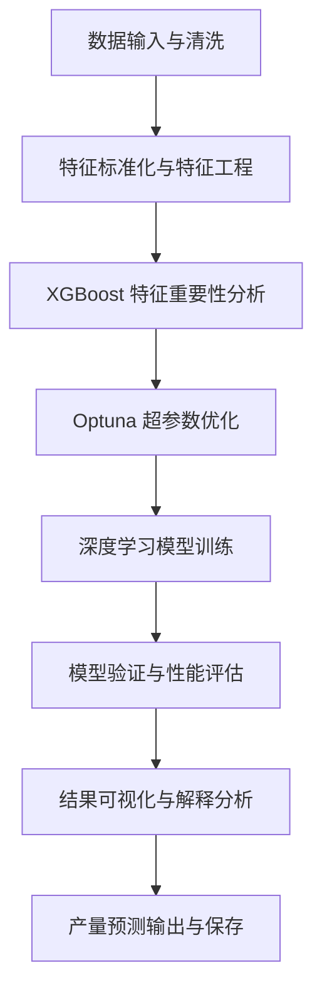

# 基于气象插值的作物产量预测模型研究（Crop Yield Prediction Supported by Meteorological Interpolation）

##  项目简介

本代码库为学术论文《基于气象插值的作物产量预测模型研究（Crop Yield Prediction Supported by Meteorological Interpolation）》的官方实现，提供了完整的算法复现和实验验证环境。本研究通过创新性地结合气象数据插值技术与深度学习模型，实现了对作物产量的精准预测。

项目: Meteorology-Assisted-Crop-Yield-Prediction 

仓库: https://github.com/ZDH4869/Meteorology-Assisted-Crop-Yield-Prediction.git 

联系: zhangdehai1412@163.com 

> **知识产权状态**: ✅ 已通过完整的知识产权保护认证

##  知识产权保护声明

### 版权信息
- **版权所有** © 2025 张德海
- **许可证类型**: [MIT License](LICENSE)
- **学术使用条款**: 详见[知识产权声明](INTELLECTUAL_PROPERTY.md)

### 保护认证
本代码已通过完整的知识产权保护流程，具备法律认可的证据链：

| 保护要素 | 状态 | 认证信息                         |
|---------|------|------------------------------|
| **时间戳存证** | ✅ 已验证 | FreeTSA Timestamping CA      |
| **数字指纹** | ✅ 已生成 | SHA256: `fd47944f...06e418c` |
| **完整性验证** | ✅ 已通过 | 29个文件完整保护                    |
| **法律效力** | ✅ 已确认 | RFC 3161标准认证                 |

### 学术使用规范
1. **审稿权限**: 论文审稿人及相关学术委员会成员有权为审稿目的运行、测试此代码
2. **传播限制**: 在论文正式接受前，请勿公开传播或用于其他学术工作
3. **引用要求**: 如参考本代码思路或方法，请在相关工作中明确引用
4. **学术诚信**: 本代码已进行时间戳存证，可作为原创性证明

### 审稿人专用说明
为便于审稿，我们提供：
- 预训练模型（如适用）：存放在 `2-产量预测代码/model_test_06`
- 测试数据集样例：由于数据较大，请从网盘（https://pan.baidu.com/s/1DopOQPK6nVeh0xjJTd7JKw?pwd=7741）下载后，存放在 `2-产量预测代码/train+text_csv数据`

## 🛡️ 时间戳认证详情

### 认证概要
- **认证时间**: 2025-10-24 10:02:07
- **认证机构**: FreeTSA Timestamping CA
- **认证标准**: RFC 3161 时间戳协议
- **哈希算法**: SHA256
- **数字指纹**: `fd47944fc2d792bb07824142a218dbe7da65b9f2f454a0eaa72de257e06e418c`


# 产量预测模型说明

---

## 一、系统总体概述

本系统旨在基于多源环境与土壤特征，实现农作物产量的精确预测。系统融合了数据预处理、特征工程、特征重要性分析、超参数优化与深度学习建模等关键模块，形成一个端到端的智能预测框架。通过机器学习与深度学习的结合，系统能够捕捉非线性特征关系，并通过可视化手段揭示模型行为与预测不确定性。

---

## 二、数据预处理与特征工程

在数据导入后，系统首先对输入数据进行质量控制与特征变换，确保建模稳定性与可解释性。数据处理步骤包括：

1. **缺失值填充**：利用均值插补、KNN插值或基于样本分布的插补函数消除缺测影响。  
2. **异常值检测**：通过标准差界限法或箱形图统计界定异常点并进行替换或删除。  
3. **特征标准化**：对每个特征执行线性标准化：  
   $$
   x' = \frac{x - \mu}{\sigma}
   $$  
   其中 $\mu$ 为特征均值，$\sigma$ 为特征标准差。  
4. **归一化处理**：将输入特征映射至 $[0,1]$ 区间，以便不同尺度特征在模型训练中具有相同影响力：  
   $$
   x^* = \frac{x - x_{min}}{x_{max} - x_{min}}
   $$  

这些预处理步骤确保了输入数据分布的平衡性与特征空间的完整性。

拓展性：为提升模型非线性表达能力，引入高阶交互项或基于地理因子的组合特征。  

---

## 三、XGBoost 特征重要性分析

在深度学习模型训练前，系统使用梯度提升树（XGBoost）评估各特征对产量预测的重要程度。  
特征重要性基于特征在分裂节点中带来的损失下降（Gain）计算：  
$$
I_j = \sum_{t \in T_j} G_t
$$  
其中 $I_j$ 表示第 $j$ 个特征的重要性，$G_t$ 为树中节点 $t$ 的分裂增益。增益定义为：  
$$
G_t = \frac{1}{2}\left(\frac{(\sum_i g_i)^2}{\sum_i h_i + \lambda}\right)
$$  
其中 $g_i$ 与 $h_i$ 分别为一阶与二阶梯度，$\lambda$ 为正则化系数。  
该结果用于特征筛选与模型输入优化，以降低冗余信息对预测性能的干扰。

---

## 四、Optuna 超参数调优

系统通过 **Optuna** 框架对深度学习与XGBoost模型的超参数进行自动化优化。调优目标函数为最小化验证集误差：  
$$
\min_{\Theta} \; L_{val}(\Theta) = \frac{1}{n}\sum_{i=1}^n (y_i - \hat{y}_i)^2
$$  

其中 $\Theta$ 为待优化的超参数集合，包括学习率、层数、神经元数、正则化参数及批次大小等。  
搜索策略采用基于树结构的贝叶斯优化（TPE）算法，根据历史采样结果更新参数分布以加速收敛。  

Optuna 调优过程中自动记录每轮实验结果，并生成超参数与性能指标的响应曲线，用于识别最优参数组合。

---

## 五、深度学习模型结构与训练

### 1. 模型结构

系统核心为多层全连接神经网络（Fully Connected Network），输入层维度与特征数一致，中间层为若干隐层，采用非线性激活函数。网络映射形式为：  
$$
\hat{y} = f_{\theta}(\mathbf{x}) = W_L \sigma_{L-1}(W_{L-1} \dots \sigma_1(W_1 \mathbf{x} + b_1) + b_{L-1}) + b_L
$$  
其中 $\sigma_i(\cdot)$ 表示激活函数（如 ReLU），$W_i$ 和 $b_i$ 为第 $i$ 层的权重与偏置。

### 2. 损失函数

模型采用 Huber 损失，以平衡异常点影响：  
$$
L = 
\begin{cases}
\frac{1}{2}(y - \hat{y})^2, & |y - \hat{y}| \le \delta \\
\delta(|y - \hat{y}| - \frac{1}{2}\delta), & |y - \hat{y}| > \delta
\end{cases}
$$  

### 3. 优化策略

参数更新遵循 AdamW 优化规则：  
$$
\theta_{t+1} = \theta_t - \eta_t \frac{m_t}{\sqrt{v_t} + \epsilon} + \lambda\theta_t
$$  
其中 $m_t$ 和 $v_t$ 分别为一阶与二阶动量项，$\lambda$ 为权重衰减系数。

### 4. 模型评价指标

训练完成后，系统通过三类误差指标评估预测性能：  
$$
MAE = \frac{1}{n}\sum_i |y_i - \hat{y}_i|, \quad
RMSE = \sqrt{\frac{1}{n}\sum_i (y_i - \hat{y}_i)^2}, \quad
R^2 = 1 - \frac{\sum_i (y_i - \hat{y}_i)^2}{\sum_i (y_i - \bar{y})^2}
$$  

---

## 六、可视化与结果分析

系统包含多种可视化分析模块，用于解释与验证模型性能：

1. **训练过程曲线**：绘制损失函数与 RMSE 的收敛趋势曲线，以分析模型学习稳定性。  
2. **残差分布图**：展示预测误差的分布特征，用于验证模型偏差是否存在系统性误差。  
3. **特征贡献可视化**：结合 SHAP 值分析不同特征对预测产量的边际贡献：  
   $$
   \phi_i = \mathbb{E}_{S \subseteq F \setminus \{i\}} [f(S \cup \{i\}) - f(S)]
   $$  
   其中 $\phi_i$ 表示第 $i$ 个特征的 Shapley 值，$F$ 为全部特征集。  
4. **超参数响应曲线**：展示不同参数对模型性能的影响关系图，用于直观评估调优结果的稳定性。  

---

## 七、系统总体流程



---

## 八、结论

本系统通过多阶段建模策略，将特征工程、特征重要性分析、超参数调优与深度学习训练有机结合，构建了一个可解释、可扩展的农作物产量预测平台。  
该框架既能从复杂环境数据中自动提取关键影响因子，又能在不确定性评估下提供高精度预测结果，可广泛应用于农业生产管理与区域产量监测中。

# 硬件要求
#### 根据具体数据量的大小可以自行进行调整
### 硬件配置
**最低要求**:
- **GPU**: NVIDIA GeForce RTX 4060 或同等性能
- **显存**: 24 GB
- **存储**: 100 GB 可用空间

**推荐配置**:
- **GPU**: NVIDIA GeForce RTX 4080/4090 或专业级显卡
- **显存**: 48 GB 或更高
- **存储**: 500 GB 
- **内存**: 64 GB
- **CPU**: Intel i7/i9 或 AMD(x86_64) 16核

### 软件环境
- **操作系统**: Windows 10/11
- **NVIDIA驱动**: 576.4
- **CUDA**: 11.8
- **Python**: 3.10
- **cuDNN**: windows-x86_64-8.6.0.163_cuda11  
此处附上cuDNN_cuda11的网盘分享链接：https://pan.baidu.com/s/1T43dt0Q79oa0pOOCC1iMmA?pwd=uejd  
（需要手动将cudnn-windows-x86_64-8.6.0.163_cuda11-archive中的bin、include、lib\x64下的文件复制到C:\Program Files\NVIDIA GPU Computing Toolkit\CUDA\v11.8中对应的文件夹中）

# 环境配置
#### 使用 pip
``` pip install -r requirements.txt ```


# 参数说明（快速开始）
#### 将下方参数依次设置，并运行即可运行整个代码流程

## 1.产量预测模型训练.py
作用：使用研究区的气象数据、土壤数据、产量数据进行预测模型的训练
#### 最终模型的训练集与验证集大小控制
```python
# 一键设置最终训练和验证集大小（预处理后）
enable_data_sampling = True  # 是否启用数据采样
max_train_samples = 5000    # 大幅增加训练集样本数，提高模型性能
max_val_samples = 1000      # 增加验证集样本数，提高评估准确性
sampling_strategy ='first_n' # 改为随机采样，提高数据多样性 'stratified' 'first_n'
```

#### 数据路径配置
```python
# 基础路径
base_dir = os.path.dirname(os.path.dirname(os.path.abspath(__file__)))
# 输入数据路径
input_data_dir = os.path.join(base_dir, "train+text_csv数据")
product_data_csv = os.path.join(input_data_dir, "maize_test_1013.csv")

# 气象数据配置 - 文件夹模式
weather_data_folder = r"2-产量预测代码/train+text_csv数据/训练气象"  # 训练气象数据文件夹路径
use_weather_folder = True  # 使用文件夹模式读取训练气象数据

soil_data_csv = os.path.join(input_data_dir, "soil_test.csv")

# 输出目录配置
output_dir = os.path.join(base_dir, "model_test_06")
model_dir = os.path.join(output_dir, "modelAA")
final_model_dir = os.path.join(output_dir, "modelAA")
label_encoder_dir = os.path.join(output_dir, "LabelEnconderAA")
scaler_dir = os.path.join(output_dir, "ScalerAA")
xgboost_dir = os.path.join(output_dir, "XGBoostAA")
logs_dir = os.path.join(output_dir, "final_logsAA")
result_dir = os.path.join(output_dir, "result_predited_csvAA")
feature_importance_dir = os.path.join(output_dir, "feature_importanceAA")
result_analysis_dir = os.path.join(output_dir, "analysis_result_mapAA")  # 应该输出2
training_analysis_dir = os.path.join(output_dir, "analysis_training_mapAA")  # 应该输出4

# 具体文件路径 max_rows_per_weather_file sample_size
label_encoder_file = os.path.join(label_encoder_dir, "label_encoder_AA.pkl")
scaler_file = os.path.join(scaler_dir, "scaler_AA.pkl")
xgboost_model_file = os.path.join(xgboost_dir, "xgb_model_AA.json")
final_model_file = os.path.join(final_model_dir, "final_model_r2_dynamic.h5")  # 动态文件名，将在训练时更新
result_file = os.path.join(result_dir, "result_predited_AA.csv")
feature_importance_file = os.path.join(feature_importance_dir, "feature_importance_AA.csv")
key_features_list_file = os.path.join(feature_importance_dir, "key_features_AA.json")
feature_importance_plot = os.path.join(feature_importance_dir, "feature_importance_plot_AA.png")
suitability_map_file = os.path.join(result_analysis_dir, "result_suitability_map_AA.png")  #
feature_importance_map_file = os.path.join(result_analysis_dir, "feature_importance.png")  #
evaluation_file = os.path.join(training_analysis_dir, "evaluation_report.json")  #
confusion_matrix_file = os.path.join(training_analysis_dir, "confusion_matrix.png")  #
accuracy_loss_map_file = os.path.join(training_analysis_dir, "Accuracy+Loss_map_AA.png")  # 只有这一个输出
regression_scatter_file = os.path.join(training_analysis_dir, "regression_scatter.png")  #```
```

#### 气象数据读取行数限制
```python
# 限制每个气象文件读取的最大行数（基于V3优化结果）
max_rows_per_weather_file = 5000 # 减少到500万行，避免过度采样

# 新增：数据质量控制配置
min_weather_coverage = 0.1  # 最小气象数据覆盖率（10%）
use_soil_primary = True  # 是否以土壤特征为主要预测因子
weather_fallback_strategy = 'interpolate'  # 气象数据缺失时的回退策略
```

#### 特征和目标变量配置
```python
# 不参与训练的特征列（基于V3优化结果）
exclude_columns = ['x', 'y', 'YYYY', 'SUIT', 'per_mu', 'per_qu']  # 排除坐标、年份、目标变量

# 分类特征列（需要进行编码的列）
categorical_columns = ['tz']  # 保留'tz'分类特征

# 范围值特征列
range_columns = []  # 不包含'tz'

# 目标变量配置（基于V3优化结果）
target_columns = {
    'classification': 'SUIT',  # 分类目标
    'regression': ['per_mu', 'per_qu']  # 回归目标
}

# 基于产量创建适宜度分类的配置
create_suitability_from_yield = True  # 是否基于产量创建适宜度分类
suitability_quantiles = [0.33, 0.67]  # 适宜度分类的分位数阈值
loss_type = 'huber'  # 使用Huber损失，对异常值更鲁棒
```

#### XGBoost参数（稳定性优化配置）
```python
xgb_params = {
    'max_depth': 2,  # 增加深度，提高学习能力
    'learning_rate': 0.1,  # 降低学习率，提高稳定性
    'n_estimators': 30,  # 增加树数量，提高性能
    'subsample': 0.8,  # 降低子采样率，防止过拟合
    'colsample_bytree': 0.8,  # 降低特征采样率，防止过拟合
    'random_state': random_seed,
    'tree_method': 'hist',
    'predictor': 'cpu_predictor',
}
```

#### 深度学习参数（稳定性优化配置）
```python
dl_params = {
    'epochs': 50,  # 增加训练轮次，确保充分学习
    'batch_size': 32,  # 减小batch size，提高训练稳定性
    'learning_rate': 0.0001,  # 降低学习率，提高训练稳定性
    'dropout_rate': 0.3,  # 降低dropout，提高模型学习能力
    'early_stop_patience': 15,  # 增加早停耐心，避免过早停止
    'l2_reg': 1e-4,  # 降低L2正则化强度
    'l1_reg': 1e-5,  # 降低L1正则化强度
    'min_delta': 0.0001,  # 降低最小改善阈值，更敏感
    'reduce_lr_patience': 5,  # 增加学习率衰减耐心
    'reduce_lr_factor': 0.7,  # 温和的学习率衰减
    'min_lr': 1e-7  # 降低最小学习率
}
```

#### 硬件配置
```python
use_gpu = True  # 是否使用GPU
gpu_memory_limit = 0.9  # GPU内存使用限制（占比）
use_amp = True  # 是否使用混合精度训练
multi_gpu_enabled = True  # 是否启用多GPU训练
gpu_memory_growth = True  # 是否启用GPU内存增长
gpu_visible_devices = None  # 指定可见的GPU设备，如"0,1"表示使用GPU 0和1
```

#### Optuna超参数配置（稳定性优化）
```python
optuna_params = {
    'n_trials': 3,  # 增加试验次数，找到更好的参数
    'timeout': 600,  # 增加超时时间，允许充分训练
    'param_ranges': {
        'lr': (1e-5, 0.001),  # 扩大学习率范围，包含更保守的值
        'neurons1': (64, 256),  # 增加神经元数量，提高模型容量
        'neurons2': (32, 128),  # 增加神经元数量
        'dropout_rate': (0.1, 0.5),  # 降低dropout范围，提高学习能力
        'batch_size': [16, 32, 64, 128],  # 增加batch size选项
        'attention_units': (16, 64),  # 增加attention units
        'l1_lambda': (1e-6, 1e-4),  # 降低L1正则化范围
        'l2_lambda': (1e-6, 1e-4),  # 降低L2正则化范围
        'optimizer_type': ['adam'],  # TensorFlow 2.10.1只支持Adam
        'activation': ['relu', 'gelu'],  # 添加GELU激活函数
        'loss_type': ['mse', 'huber']  # 添加Huber损失
    }
}
```
#### 使用保守参数训练最终模型，避免NaN问题
‘train_final_model_conservative’函数中 第5390行左右
```python
epochs=30,  # 进一步减少epochs，加快训练
batch_size=conservative_params['batch_size'],
callbacks=callbacks,
verbose=1
```
#### 特征重要性配置（防过拟合优化）
```python
feature_importance = {
    'threshold': 0.05,  # 进一步提高阈值，减少特征数量
    'sample_size': 50000,  # 减少采样数量，适合小数据集
    'save_plots': True,
    'min_features': 10,  # 进一步减少最小特征数
    'max_features': 30  # 进一步减少最大特征数，防止过拟合
}
```

#### 集成学习配置（速度优化）
```python
ensemble_params = {
    'n_splits': 2,  # 保持较少的交叉验证折数，加快训练
    'n_models': 1,  # 保持单模型，减少训练时间
    'voting': 'soft',
    'weights': None,
    'bootstrap': False,  # 禁用bootstrap采样，加快训练
    'bootstrap_ratio': 0.8  # 降低bootstrap采样比例
}
```

#### 数据增强配置（速度优化）
```python
augmentation_params = {
    'augmentation_factor': 0.2,  # 减少数据增强比例，加快训练
    'noise_factor': 0.02,  # 降低噪声强度
    'feature_mixing': False,  # 禁用特征混合，加快训练
    'random_rotation': False,
    'gaussian_noise': True,  # 添加高斯噪声
    'feature_dropout': 0.2,  # 增加特征随机丢弃比例
    'mixup_alpha': 0.4,  # 增加Mixup数据增强
    'cutmix_alpha': 1.0  # CutMix数据增强
}
```

## 2 模型特征映射.py 
作用：实现产量预测模型特征重要性名称映射回训练集列名，用于后续变量分析、产量预测
#### 文件路径配置
```python
 # 基于训练代码分析的原始数据列名定义（自行更具实际数据列名进行修改）
 # 气象数据原始列名
self.weather_columns_original = [
   'Lon', 'Lat', 'altitude', 'YYYY', 'MM', 'Tsun_mean', 'TAVE_mean',
   'Tmax_mean', 'Tmin_mean', 'Rain_mean', 'GTAVE_mean', 'GTmax_mean',
   'GTmin_mean', 'Sevp_mean'
]
# 土壤数据原始列名
self.soil_columns_original = [
   'x', 'y', 'TZ', 'CEC', 'PH', 'SOC', 'SOCD', 'TK', 'TND', 'TPD'
]
# 产量数据原始列名
self.product_columns_original = [
   'x', 'y', 'SUIT', 'YYYY', 'per_mu', 'per_qu'
]

# 特征重要性文件路径
feature_importance_file = r"2-产量预测代码/model_test_06/feature_importanceAA/feature_importance_AA.csv"  # 特征重要性CSV文件路径
original_feature_names_file = r"2-产量预测代码/model_test_06/feature_importanceAA/original_feature_names.txt"  # 原始特征名称文件路径

# 输出文件夹配置
output_folder = r"2-产量预测代码/model_test_06/feature_importanceAA"  # 输出文件夹路径
timestamp = datetime.now().strftime("%Y%m%d_%H%M%S")  # 时间戳格式
timestamped_folder = os.path.join(output_folder, f"mapping_results_{timestamp}")  # 带时间戳的输出文件夹
```

## 3 产量模型调用预测.py
作用：调用训练好的模型，结合研究区土壤数据、气象数据，对研究区进行产量预测
#### 数据路径配置
```python
# 基础路径
base_dir = os.path.dirname(os.path.dirname(os.path.abspath(__file__)))

# 输入数据路径
input_data_dir = os.path.join(base_dir, "train+text_csv数据")

# 预测气象数据配置 - 文件夹模式
weather_data_folder = r"2-产量预测代码/train+text_csv数据/预测气象"  # 训练气象数据文件夹路径
use_weather_folder = True  # 使用文件夹模式读取训练气象数据

soil_data_csv = os.path.join(input_data_dir, "soil_test.csv") # 当用于预测时，保持土壤相同（soil_data_csv=test_soil_csv）
test_soil_csv = os.path.join(input_data_dir, "soil_test.csv") # 当用于预测时，保持土壤相同

# 输出目录配置
_default_model_name = "model_test_06"  # 训练代码中的模型输出目录
```
```
# 具体模型路径设置 第325行左右
cls.final_model_file = os.path.join(cls.final_model_dir, "final_model_r2_r2_0.9196.h5")
```

# 注意事项

### 1 坐标系要求
- 气象站点数据坐标字段名必须为`lon/lat`，实际对应`x/y`
- 使用投影坐标系，`lat/y`坐标为7位数
- 地形数据和气象站点数据必须使用相同的坐标系

### 2 数据要求
- 气象、土壤、产量csv数据需要相同的网格分布（本文采用90m*90m）
- 参考气象csv字段名：['Lon', 'Lat', 'altitude', 'YYYY', 'MM', 'Tsun_mean', 'TAVE_mean', 'Tmax_mean',  'Rain_mean',]
- 参考土壤csv字段名：['x', 'y', 'TZ', 'CEC', 'PH', 'SOC', 'SOCD', 'TK', 'TND', 'TPD']
- 参考产量csv字段名：['x', 'y', 'SUIT', 'YYYY', 'per_mu', 'per_qu']

### 3 内存管理
- 根据系统内存调整`chunk_size`和`batch_size`参数
- 大文件处理时建议使用分块处理模式
- GPU内存不足时可降低`gpu_memory_fraction`参数

### 4 性能优化
- 启用GPU加速可显著提升训练和预测速度
- 使用多进程并行处理可提高效率
- 根据数据量调整`parallel_workers`参数

### 5 运行时长
- 测试数据约2小时内可以完成模型训练+结果预测
- 参考时长：6*500万行气象数据+2GB土壤数据+1.8GB产量数据-> 至少8小时

# 数据来源：
国家科技资源共享服务平台—国家地球系统科学数据中心-土壤分中心(http://soil.geodata.cn)    
Soil Sub Center, National Earth System Science Data Center , National Science & Technology Infrastructure (http://soil.geodata.cn)

# 致谢：
感谢国家科技资源共享服务平台-国家地球系统科学数据中心-土壤分中心(http://soil.geodata.cn)提供数据支撑。
Thanks for Acknowledgement for the data support from "Soil Sub Center, National Earth System Science Data Center , National Science & Technology Infrastructure (http://soil.geodata.cn)”


